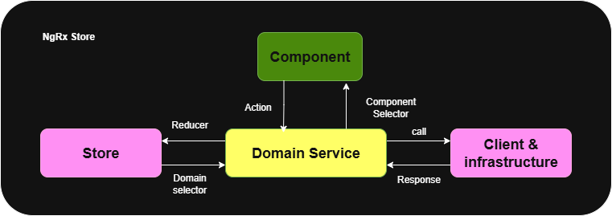
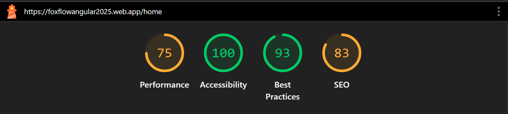

<a id="readme-top"></a>

<!-- PROJECT IMAGE -->
<div align="center">
  <a href="https://github.com/IevgeniiaAbdulina/FoxFlow-Task-Management-Angular-app">
    
  </a>
</div>

<h2 align="center">FoxFlow</h3>

<p align="center">
  Task Management Angular Application
  <br /><br />
  <a href="https://github.com/IevgeniiaAbdulina/FoxFlow-Task-Management-Angular-app"><strong>Explore the docs</strong></a>
  &middot;
  <a href="https://foxflowangular2025.web.app/"><strong>View Demo</strong></a>
</p>

<!-- TABLE OF CONTENTS -->
<details>
  <summary>Table of Contents</summary>
  <ol>
    <li>
      <a href="#about-the-project">About The Project</a>
      <ul>
        <li><a href="#built-with">Built With</a></li>
      </ul>
    </li>
    <li>
      <a href="#getting-started">Getting Started</a>
      <ul>
        <li><a href="#prerequisites">Prerequisites</a></li>
        <li><a href="#installation">Installation</a></li>
      </ul>
    </li>
    <li><a href="#usage">Usage</a></li>
    <li><a href="#roadmap">Roadmap</a></li>
    <li><a href="#architecture-diagram">Architecture</a></li>
    <li><a href="#feature-sliced-project-structure">Project structure</a></li>
    <li><a href="#performance-budgets">Performance budgets</a></li>
    <li><a href="#contributors">Contributors</a></li>
    <li><a href="#acknowledgments">Acknowledgments</a></li>
  </ol>
</details>

<!-- ABOUT THE PROJECT -->

## About The Project

<p>
  FoxFlow is an intuitive task management application designed to streamline your workflow and enhance productivity. With its user-friendly interface, FoxFlow allows you to easily create, organize, and prioritize tasks, ensuring that you stay on top of your projects. Collaborate seamlessly with team members, set deadlines, and track progress in real-time, making it the perfect tool for individuals and teams looking to optimize their task management experience. Whether you're managing personal to-do lists or complex team projects, FoxFlow adapts to your needs, helping you achieve your goals efficiently.
</p>

| Why Choose FoxFlow      | Description                                                                                                                                                     |
| ----------------------- | --------------------------------------------------------------------------------------------------------------------------------------------------------------- |
| User-Friendly Interface | FoxFlow features an intuitive design that makes it easy for users of all skill levels to navigate and manage tasks efficiently.                                 |
| Collaboration Tools     | The application offers robust collaboration features, allowing teams to work together seamlessly, share updates, and communicate effectively on projects.       |
| Customizable Workflows  | FoxFlow enables users to tailor their task management experience with customizable workflows, ensuring that it fits their unique project needs and preferences. |

<p align="right"><a href="#readme-top">⬆️ back to top</a></p>

### Built With

- Angular CLI: 20.2.1
- Node: 24.7.0
- Package Manager: npm 10.9.2

FoxFlow is built using a modern tech stack that includes:

- ✅ Angular - Frontend framework for building the UI.
- ✅ TypeScript - Programming language for Angular development.
- ✅ Firebase - Backend services including Firestore for database, Authentication, and Hosting.
- ✅ OAuth - Secure authentication for user login.
- ✅ RxJS - For reactive programming in Angular.
- ✅ NgRx - State management for Angular applications.
- ✅ SCSS - stylesheets using the Angular CLI.
- ✅ Angular Material - For responsive UI design.
- ✅ Google Fonts & Icons & custom icons.
- ✅ ESLint, Prettier, Husky, Lint-Staged - Clear coding guidelines for a clean and consistent codebase.
- ✅ Testing Jasmine/Karma - unit tests for core logic and **E2E** for the main user flow.

<p align="right"><a href="#readme-top">⬆️ back to top</a></p>

<!-- GETTING STARTED -->

## Getting Started

### Prerequisites

A list of everything you need to use the software and how to install it.

```bash
npm install npm@latest -g
```

### Installation

#### Clone the repository

```bash
git clone https://github.com/IevgeniiaAbdulina/FoxFlow-Task-Management-Angular-app.git
```

#### Setting up Firestore and Firebase Google Auth

Before running the FoxFlow project, you'll need to set up Firebase for database management and Firebase Google Auth for user authentication.

[Firestore](https://console.firebase.google.com/)

[Firebase Auth](https://firebase.google.com/docs/auth)

#### Create `.env` file

In the root directory, create the `.env` file and add the required keys.

```
NG_APP_API_KEY=apiKey
NG_APP_AUTH_DOMAIN=authDomain
NG_APP_DATABASE_URL=databaseURL
NG_APP_PROJECT_ID=projectId
NG_APP_STORAGE_BUCKET=storageBucket
NG_APP_MESSAGING_SENDER_ID=messagingSenderId
NG_APP_APP_ID=appId
NG_APP_MEASUREMENT_ID=measurementId
```

```ts
// src/environments/environment.ts
export const environment = {
  production: false,
  firebase: {
    apiKey: import.meta.env.NG_APP_API_KEY,
    authDomain: import.meta.env.NG_APP_AUTH_DOMAIN,
    databaseURL: import.meta.env.NG_APP_DATABASE_URL,
    projectId: import.meta.env.NG_APP_PROJECT_ID,
    storageBucket: import.meta.env.NG_APP_STORAGE_BUCKET,
    messagingSenderId: import.meta.env.NG_APP_MESSAGING_SENDER_ID,
    appId: import.meta.env.NG_APP_APP_ID,
    measurementId: import.meta.env.NG_APP_MEASUREMENT_ID,
  },
};
```

#### Install dependencies

```bash
# Install frontend dependencies
npm install
```

### Development server

```bash
# To start a local development server, run:
ng serve
```

Once the server is running, open your browser and navigate to `http://localhost:4200/`. The application will automatically reload whenever you modify any of the source files.

### Building

```bash
# To build the project in development mode run:
npm run build:dev
```

```bash
# To build the project in production mode run:
npm run build:prod
```

This will compile your project and store the build artifacts in the `dist/` directory.

### Running unit tests

To execute unit tests with the [Karma](https://karma-runner.github.io) test runner, use the following command:

```bash
ng test
```

### Running end-to-end tests

```bash
ng e2e
```

### Running ESLint

```bash
ng lint
```

### Running Prettier

```bash
ng format
```

Clear coding guidelines for a clean and consistent codebase.

<p align="right"><a href="#readme-top">⬆️ back to top</a></p>

<!-- USAGE EXAMPLES -->

## Usage

<!--  Use this space to show useful examples of how a project can be used.
      Additional screenshots, code examples and demos work well in this space.
      You may also link to more resources. -->

1. **Task Creation and Management**: Users can create, edit, and delete tasks, assign them to team members, and set deadlines.
2. **Project Collaboration**: Team members can collaborate on projects by sharing tasks, commenting, and updating task statuses.

- _Screenshots_:
  - Task Detail View: A detailed view of a specific task, including comments, attachments, and status updates.

3. **Progress Tracking**: Users can track the progress of tasks and projects through visual indicators like progress bars or Kanban boards.

- _Screenshots_:
  - Dashboard: A view of the main dashboard displaying active projects and tasks.
  - Task List: A screenshot showing a list of tasks with options to filter, sort, and search.
  - Project Overview: A visual representation of project progress, including completed and pending tasks.

4. **Notifications and Reminders**: Users receive notifications for upcoming deadlines, task assignments, and comments from team members.
5. **User Authentication**: Secure login and registration using Firebase OAuth, allowing users to manage their tasks safely.

- _Screenshots_:
  - Login Screen: A screenshot of the login form where users enter their credentials.

### Code Examples

1. Task Model (task.model.ts)

```ts
export interface Task {
  id: string;
  title: string;
  description: string;
  assignedTo: string;
  dueDate: Date;
  status: 'pending' | 'in-progress' | 'completed';
}
```

### Demo of features

Video Walkthrough: Create a video walkthrough demonstrating how to use the application, showcasing features like task creation, collaboration, and progress tracking.

<details>
  <summary>✏️ Task creation</summary>
  <video></video>
</details>

<details>
  <summary>🚀 Collaboration</summary>
  <video></video>
</details>

<details>
  <summary>🎯 Progress tracking</summary>
  <video></video>
</details>

_For more examples, please refer to the [Project Wiki](https://github.com/IevgeniiaAbdulina/FoxFlow-Task-Management-Angular-app/wiki)_

<p align="right"><a href="#readme-top">⬆️ back to top</a></p>

<!-- ROADMAP -->

## Roadmap

| Done | Feature                                    | Description                                                                                                               |
|------|--------------------------------------------|---------------------------------------------------------------------------------------------------------------------------| 
| ✅    | User Authentication                        | Implement OAuth for secure login and user management. Google, GitHub (OAuth)                                              |
| 📊   | **Boards:**                                |
| 🔲   | List Board                                 | Organize tasks in a powerful table.                                                                                       |
| 🔲   | Kanban Board                               | Track work in a Kanban view.                                                                                              |
| 🔲   | Analytics Dashboard                        | Generate real-time reports with customizable charts. (Use Signals & Reactivity)                                           |
| 🎯   | **Actions:**                               |
| 🔲   | Task Creation and Assignment               | Users can create tasks, assign them to team members, and set deadlines.                                                   |
| 🔲   | Subtasks                                   | Allow users to break down tasks into smaller, manageable subtasks.                                                        |
| 🔲   | Search and Filter                          | Enable users to search and filter tasks based on various criteria.                                                        |
| 🔲   | Sort                                       | Enable users to sort tasks by Due date or Assignee members.                                                               |
| 🚀   | **Collaboration features:**                |
| 🔲   | Collaboration Tools                        | Allow users to comment on tasks and share files.                                                                          |
| 🔲   | Task Tracking                              | Monitor task progress and status updates.                                                                                 |
| 🔲   | Notifications                              | Send reminders for deadlines and updates on task status. (Optional: add accent text color or status label on a task card) |
| 🔲   | Labels and Tags                            | Organize tasks with customizable labels and tags.                                                                         | 👀  |
| 🎨   | **Visual implementation:**                 |
| 🔲   | Dark Mode                                  | Offer a dark mode option for customizing the user interface.                                                              |
| ✅    | Mobile Responsiveness                      | Ensure the application is usable on mobile devices.                                                                       |
| 🔲   | Angular animations                         | That improve UX.                                                                                                          |
| 🔲   | Good empty/loading/error states, skeletons | Show user-friendly messages and view without content.                                                                     |
| 🌐   |                                            |
| ✅    | Internationalization                       | Two languages using Angular i18n or ngx-translate.                                                                        |
| 💻   | **User Experience Enhancements:**          |
| 🔲   | Drag-and-Drop Interface                    | Implement a user-friendly drag-and-drop interface for task management.                                                    |
| 🔲   | Keyboard Shortcuts                         | Provide keyboard shortcuts for common actions to improve efficiency.                                                      |
| 🔲   | Tooltips                                   | Include guided tutorials for new users to help them navigate the application.                                             |
| 🔲   | Mark task Complete                         | Show success notification or animated image.                                                                              |

<p align="right"><a href="#readme-top">⬆️ back to top</a></p>

<!-- ARCHITECTURE -->

## Architecture diagram

<div align="left">
  
</div>

<p align="right"><a href="#readme-top">⬆️ back to top</a></p>

<!-- FOLDER STRUCTURE -->

## Feature-sliced project structure

```
src/
├── app/
│   ├── core/
│   │   ├── services/                      # Application business logic
│   │   ├── guards/
│   │   │   ├── auth.guard.ts              # Protects routes based on authentication
│   │   ├── interceptors/
│   │   │   ├── auth.interceptor.ts        # Intercepts HTTP requests for authentication
│   ├── auth/
│   │   ├── components/
│   │   │   ├── login/
│   │   │   │   ├── login.ts               # Login page component
│   │   │   ├── register/
│   │   │   │   ├── register.ts            # Registration page component
│   │   ├── services/
│   │   │   ├── auth.service.ts            # Handles authentication logic
│   │   ├── auth-store/
│   │   │   ├── auth-store.ts              # NgRx store for authentication state
│   │   │   ├── auth-reducer.ts            # NgRx reducer for authentication state
│   ├── features/
│   │   ├── components/
│   │   │   ├── task-list/
│   │   │   │   ├── task-list.ts           # Displays list of tasks
│   │   │   ├── task-detail/
│   │   │   │   ├── task-detail.ts         # Shows details of a selected task
│   │   ├── services/
│   │   │   ├── task.service.ts            # Manages task-related API calls
│   │   ├── task-store/
│   │   │   ├── task-store.ts              # NgRx store for task state
│   │   │   ├── task-reducer.ts            # NgRx reducer for task state
│   ├── shared/
│   │   ├── interfaces/
│   │   ├── directives/
│   │   ├── pipes/
│   │   ├── types/
│   │   ├── enums/
│   │   ├── utils/                         # Simple functions
│   │   ├── components/
│   │   │   ├── header.ts                  # Application header component
│   │   │   ├── footer.ts                  # Application footer component
│   │   ├── models/
│   │   │   ├── task.model.ts              # Task data model
│   │   │   ├── user.model.ts              # User data model
│   ├── app.routes.ts                      # Defines application routes
│   ├── app.ts                             # Root component
├── assets/                                # Static assets (images, styles, etc.)
├── environments/                          # Environment-specific configurations
│   ├── environment.ts                     # Production environment settings
│   ├── environment.development.ts         # Development environment settings
└── index.html                             # Main HTML file
```

<p align="right"><a href="#readme-top">⬆️ back to top</a></p>

<!-- PERFORMANCE BUDGETS -->

## Performance budgets

### Performance budgets with the Angular CLI

The Angular CLI performs the checks at build time, looking at the production assets and verifying their sizes.

| Initial chunk files   | Names         |  Raw size | Estimated transfer size |
| --------------------- | ------------- | --------: | ----------------------: |
| main-6NGPTIUD.js      | main          | 837.84 kB |               216.67 kB |
| polyfills-ED6LRYKL.js | polyfills     |  34.59 kB |                11.32 kB |
| styles-DTTV3AOM.css   | styles        |   8.10 kB |                 1.32 kB |
|                       | Initial total | 880.53 kB |               229.31 kB |

Application bundle generation complete. [5.920 seconds]

### Performance budgets with the Lighthouse

Lighthouse opens the deployed version of the application and measures the asset size.

<div align="left">
  
</div>

<p align="right"><a href="#readme-top">⬆️ back to top</a></p>

<!-- DEPLOYMENT -->

## Deployment

Hosted on Firebase Hosting: https://foxflowangular2025.web.app

- Configured Firebase Hosting with Angular build (`dist/foxflow/browser` via `@ngx-env/builder`).
- Supports SPA routing and i18n (English/Polish via `ngx-translate`).
- Environment variables loaded via `.env` files and `@ngx-env/builder`.
- Deployment command: `ng build --configuration production && firebase deploy --only hosting`.

<!-- CONTRIBUTING -->

## Contributors

[ Olga Rekun](https://github.com/rekunolya)

[ Ina Flaryanovich-Kukharava](https://github.com/inafk)

[ Ievgeniia Abdulina](https://github.com/ievgeniiaabdulina)

[ Aliaksei Hancharevich](https://github.com/aliaksei-sl) (mentor)

Project Link: [https://github.com/IevgeniiaAbdulina/FoxFlow-Task-Management-Angular-app](https://github.com/IevgeniiaAbdulina/FoxFlow-Task-Management-Angular-app)

<p align="right"><a href="#readme-top">⬆️ back to top</a></p>

<!-- ACKNOWLEDGMENTS -->

## Acknowledgments

This is a list of resources we find useful and would like to thank.

- [Angular - Getting started](https://angular.io/guide/quickstart) 🅰️
- [TypeScript - Getting started](https://www.typescriptlang.org/docs/handbook/typescript-tooling-in-5-minutes.html) 📏
- [Angular Material UI component library](https://material.angular.io/components/categories)
- [My favorite Angular Setup in 2025](https://dev.to/this-is-angular/my-favorite-angular-setup-in-2025-3mbo) by Rainer Hahnekamp.

<p align="right"><a href="#readme-top">⬆️ back to top</a></p>
